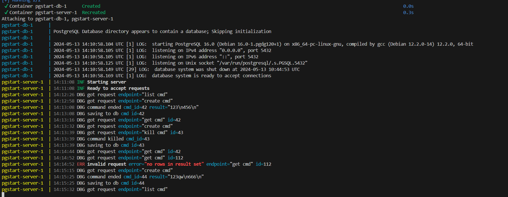

# Тестовое задание на вакансию Go-разработчик
[Ссылка на условие](https://gist.github.com/ixpectus/aec3f753a3209fbd8100c1b2c42d5756)

## Запуск

```
git clone https://github.com/soqet/pgstart-2024.git
cd pgstart-2024/
cp ./.env.example ./.env
docker compose build && docker compose up
```
[Документация](/doc/README.md)



Использованная ОС: Linux (Debian 12)

## Дополнительный функционал

1. Остановка команды,
1. Получение вывода незаконченной команды.
